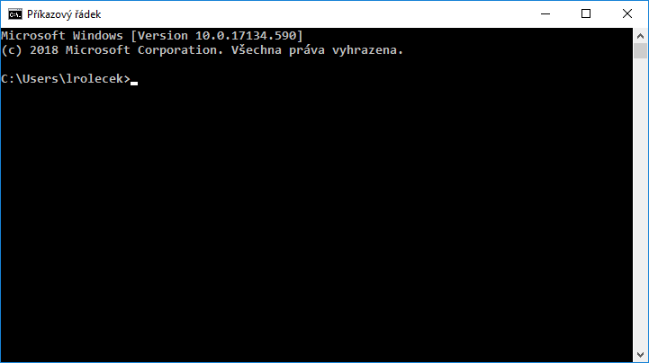
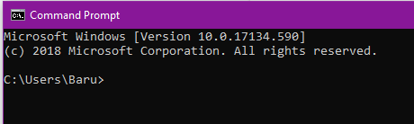
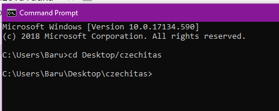
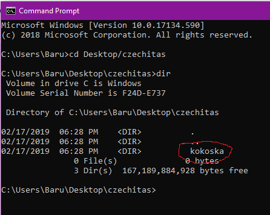

# Příkazová řádka

Příkazovou řádkou (takové to černé okno, které člověk vidí ve filmech, když hacker hackuje :)) uživatel komunikuje s počítačem pomocí zapisováním příkazů. Nepoužívá se zde myš ani menu.

Příkazová řádka se často také označuje jako **terminál**.

* Ve **Windows** se otevírá pomocí Start -> napsat na klávesnici `cmd` (česky: příkazový řádek, anglicky: command prompt).
* Na **Macu** ji najdeš v Applications -> Utilities -> Terminal.
* Na **Linuxu** ve vyhledávání zadat Konsole nebo Terminál (klávesová zkratka pro otevření Terminálu na Linuxu je `Ctrl-Alt-T`).

V případě, že se Ti to nepovede, tak zkus použít google a zadat svůj operační systém a něco ve smyslu “How to open terminal”.

Okno terminálu lze otevřít i přímo v editoru VS Code v menu Terminal -> New Terminal (je tam uvedena i klávesová zkratka).

Ať už terminál otevřeš jakkoliv a kdekoliv, mělo by se ti otevřít černé okno podobné obrázku níže (takto konkrétně vypadá příkazová řádka Windows).

A teď můžeme začít zadávat příkazy. V tabulce níže najdeš přehled, se kterými si na našem kurzu vystačíme. Budeme potřebovat hlavně příkazy pro pohyb v adresářové struktuře. Viz příklad, který bude ukázán na operačním systému Windows. Příkazy pro Windows a Unixové systémy (to je macOS a Linux) se trochu liší.

V případě, že by tě příkazová řádka a práce s ní zajímala více, tak na googlu najdeš spoustu článků a zdrojů.

## Příklad:

Chci se dostat k adresáři s názvem kokoska, který mám ASI uložený v adresáři czechitas na ploše. V jednotlivých krocích vysvětlím, jak se dostat do složky czechitas a poté si ověřit, že doopravdy obsahuje adresář kokoska. Doporučuje se adresáře a soubory pojmenovávat bez diakritiky a mezer.

### 1. Otevřu příkazovou řádku

Tady vidím, že jsem na disku *C:* v adresáři *Baru*, která je v adresáři *Users*.

### 2. Změna adresáře

Vím, že se potřebuji dostat na plochu a konkrétně do adresáře *czechitas*, a proto použiji příkaz `cd Desktop/czechitas`.

Adresář, do kterého se chci dostat, musí být obsažen v adresáři, ve které “stojím”.  Pomocí lomítek se můžu dostat do následujícího adresáře, jako v našem případě, kde jsem za Desktop přidala lomítko a název požadovaného adresáře.

### 3. Vypis obsahu adresáře

Pomocí příkazu `dir` si můžu ověřit, že v adresáři *czechitas* je doopravdy adresář s názvem *kokoska*.

V případě, že tvůj počítač má více disků, tak stačí do příkazové řádky napsat název disku a dvojtečka (například `D:`). To tě přepne na daný disk a můžeš se pak na něm pohybovat, jak jsme si vysvětlili výše.

## Základní příkazy

Popis příkazu | Windows | macOs/Linux
--------------|---------|------------
Změna adresáře | `cd kokoska` | `cd kokoska`
Výpis aktuálního adresáře (kde se zrovna nacházíš) | `cd` | `pwd`
Výpis obsahu adresáře (souborů a podsložek) | `dir` | `ls`
