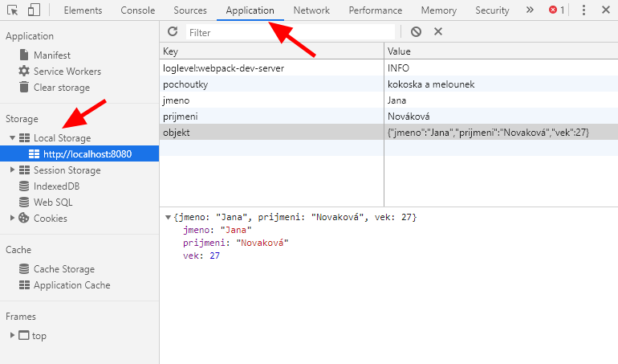

# Local storage

Local storage je uložiště dat na lokálním disku uživatele, ke kterému máme přístup z JavaScriptu. Toto uložiště je oddělené pro každý *origin* - tj. např. internetovou doménu, lokální server, apod. Zjednodušeně, všechny stránky v rámci jednoho webu sdílejí jednu local storage, ale každý web má svou vlastní.

Pozor: v rámci lokálního serveru toto nemusí platit a všechny stránky (např. příklady z našeho kurzu), na které přistupujeme např. na adrese http://localhost:8080, mají stejný *origin* (= localhost) a tudíž sdílejí společnou local storage.

Dokumentace k local storage:
* [Local Storage na JavaScript.info](https://javascript.info/localstorage)
* [Local Storage na MDN](https://developer.mozilla.org/en-US/docs/Web/API/Window/localStorage)

## Perzistentní úložiště

Local storage má výhodu v tom, že jde o tzv. perzistentní úložiště. Data v něm zůstávají i po zavření prohlížeče nebo při znovunačtení stránky. Do local storage si můžeme ukládat data, která chceme mít k dispozici i při příštím načtení stránky.


## Bezpečnost

Local storage není nijak zabezpečená a přístup do ní mají všechny skripty běžící na stránce. Pokud tedy např. do stránky připojíte cizí JavaScript, ten automaticky získává přístup k datům v local storage pro daný web.

Do local storage proto **nikdy neukládejte přístupové ani jiné citlivé údaje**.


## Local storage v prohlížeči

Obsah local storage pro daný web (origin) si můžete prohlédnout ve vývojářských nástrojích v prohlížeči.

V prohlížeči Chrome otevřeme vývojářské nástroje (stisk F12) a přepneme se na záložku **Application**. V pruhu nalevo vybereme **Local Storage** a napravo uvidíme obsah lokálního úložiště pro daný *origin*. V případě potřeby zde můžeme položky přidávat, editovat i mazat.




## Local Storage v JavaScriptu

Přístup do local storage v JavaScriptu je velmi jednoduchý. Data se ukládají vždy jako pár **klíč - hodnota**. Klíč je jméno, pod jakým data do local storage ukládáme.

K local storage přistupujeme pomocí objektu `window.localStorage`, který má metody `setItem`, `getItem`, `removeItem` a `clear`.

### Ukládání dat

```javascript
// V local storage se vytvoří položka "jmeno", která bude obsahovat "Jana Nováková".
// Pokud už položka "jmeno" existuje, tak se hodnota v ní nahradí.
localStorage.setItem('jmeno', 'Jana Nováková');
```

### Čtení dat

```javascript
// Přečte z local storage hodnotu položky "jmeno"
let jmeno = localStorage.getItem('jmeno');
```

### Odebrání položky z local storage

```javascript
// Odstraní položku "jmeno" z local storage
localStorage.removeItem('jmeno');
```

### Smazání local storage

```javascript
// Smaže všechny položky v local storage pro daný origin
localStorage.clear();
```


## Ukládání složitějších dat do local storage

V local storage se uchovávají **pouze textové řetězce**. Pokud chceme do local storage uložit složitější datovou strukturu(např. pole nebo objekt), musíme ji nejprve zkonvertovat na JSON, což je textová reprezentace objektu.

K tomu můžeme použít metodu `JSON.stringify()`:

```javascript
let osoba = {
  jmeno: 'Jana',
  prijmeni: 'Nováková',
  vek: 27
};

localStorage.setItem('osoba', JSON.stringify(osoba) );

/*
Do local storage se pod klíčem 'osoba' uloží textový řetězec:
{"jmeno":"Jana","prijmeni":"Nováková","vek":27}

Kdybychom nepřevedli objekt na JSON, ale udělali pouze:
localStorage.setItem('osoba', osoba);
uložila by se do local storage následující hodnota:
[object Object]
*/
```

Když chceme data z local storage přečíst, musíme je zase z JSONu převést na javascriptový objekt nebo pole. K tomu použijeme metodu `JSON.parse()`:

```javascript
let osoba = JSON.parse( localStorage.getItem('osoba') );

console.log(osoba);

/*
V konzoli vidíme, že se jedná o skutečný objekt a ne jeho textovou reprezentaci
{
  jmeno: 'Jana',
  prijmeni: 'Nováková',
  vek: 27
}
*/
```